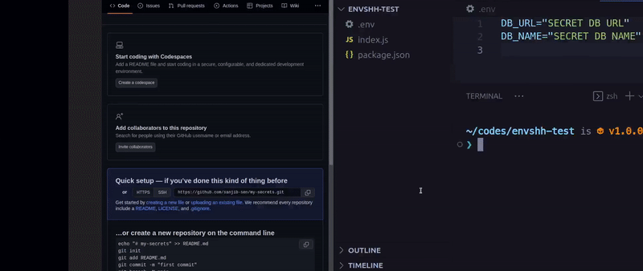

> Check `envshh push --help` or `envshh help push` for more details

Push local environment variables to Local and/or Remote Repository



## Usage

```sh
envshh push <options>
```

## Options

- [project](/envshh/core-concepts/01-project)
- [branch](/envshh/core-concepts/02-branch)
- [env-path](/envshh/core-concepts/03-env-path)
- [offline](/envshh/core-concepts/05-offline)
- [instance](/envshh/core-concepts/04-instance)
- **message** `-m, --message <message>` (Optional):
  Customized commit message. If not specified, Envshh will use Cureent Date and Time as the commit message `new Date.toString()`

## Example

```sh
npx envshh push
```
