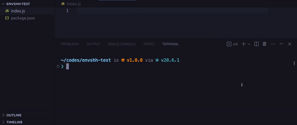

> Check `envshh help pull` for more details

Pull environment variables from Local and/or Remote Repository



## Usage

```sh
envshh pull <options>
```

## Options

- [project](/envshh/core-concepts/01-project)
- [branch](/envshh/core-concepts/02-branch)
- [offline](/envshh/core-concepts/05-offline)
- [instance](/envshh/core-concepts/04-instance)
- [help](/envshh/core-concepts/08-help)

## Example

```sh
npx envshh pull
```
