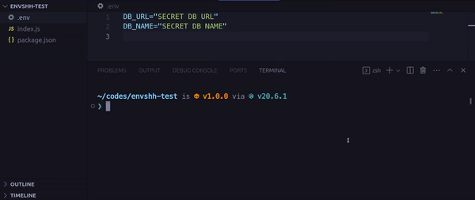

> Check `envshh generate --help` or `envshh help generate` for more details

Generate .env.example file



## Usage

```sh
envshh generate <options>
```

## Options

- [env-path](/envshh/core-concepts/03-env-path)
- value `--value <value>` (Optional):
  Specify a value to replace empty values in the .env example file. For example, if you specify `--value "<insert-text>"`, the generated file will have `EXAMPLE=<insert-text>` instead of `EXAMPLE=`
- suffix `--suffix <suffix>` (Optional):
  Specify a suffix to put after the .env filename in place of 'example'. For example, if you specify `--suffix dev`, the generated file will be named `.env.dev`
