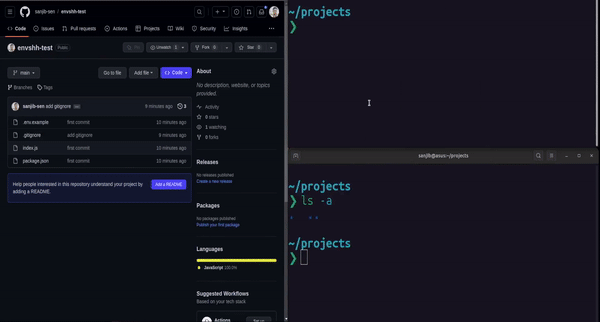

> Check `envshh clone --help` or `envshh clone pull` for more details

git clone and envshh pull at the same time



## Usage

```sh
envshh pull <options> [repository] <directory>
```

## Arguments

- **repository** `<repository>` (Required):
    Repository to clone from

- **directory** `<directory>` (Optional):
    Directory to clone into. If not specified, Envshh will use the repository name as the directory name

## Options

- [project](/envshh/core-concepts/01-project)
- [branch](/envshh/core-concepts/02-branch)
- [offline](/envshh/core-concepts/05-offline)
- [instance](/envshh/core-concepts/04-instance)

## Example

```sh
npx envshh clone https://github.com/sanjib-sen/envshh
```
