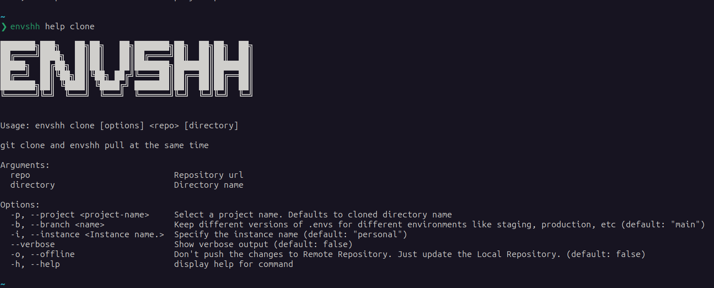

import cloneTutorial from '../../../assets/recordings/clone.webm';

> Check `envshh help clone` for more details from the command line

git clone and envshh [pull](/commands/pull) at the same time

## Demo

<video width="1478" height="772" controls>
  <source src={cloneTutorial} type="video/webm" />
</video>

## Screenshot



## Usage

```sh
envshh clone <options> [repository] <directory>
```

## Arguments

- **repository** `<repository>` (Required):
  Repository to clone from

- **directory** `<directory>` (Optional):
  Directory to clone into. If not specified, Envshh will use the repository name to get the directory name

## Options

- [project](/core-concepts/project)
- [branch](/core-concepts/branch)
- [offline](/core-concepts/offline)
- [instance](/core-concepts/instance)

## Example

```sh
npx envshh clone https://github.com/sanjib-sen/envshh
```

```sh
npx envshh clone https://github.com/sanjib-sen/envshh envshh-directory # Custom Directory
```

```sh
npx envshh clone https://github.com/sanjib-sen/envshh -p my-project -b staging-branch -i work-instance # Options for pull
```
