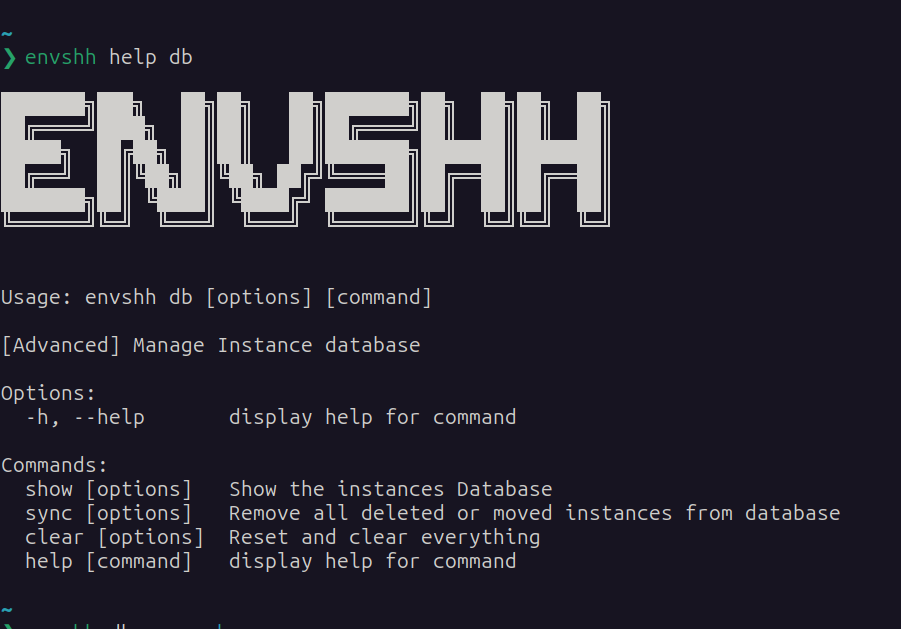

> Check `envshh help db` for more details

Manage the envshh [database of instances](/configuration/#instances)

## Screenshot



## show

Show all of the [instances](/core-concepts/instance) (with their [name](/core-concepts/instance#1-name-of-the-instance), [remoteRepoUrl](2-remote-repository-url), and [localDirectoryPath](http://localhost:4321/core-concepts/instance/#3-local-directory-path)) in the database in [console.table()](https://developer.mozilla.org/en-US/docs/Web/API/console/table) format

```sh
envshh db show
```

You can also show the information of a specific instance with

```sh
envshh db show -i <instanceName>
```

e.g: `envshh db show -i work`

## sync

If you manually move your [instances localDirectory](/core-concepts/instance/#3-local-directory-path) without using the [instance edit](/commands/instance#edit) command, then you can't use the [instance push](/commands/instance#push) and [instance pull](/commands/instance#pull) commands using that [instance](/core-concepts/instance) and this might throws an error. In that case you can sync your database which will automatically remove the instance localDirectories that are no longer available. After that, you can use the [instance create](/commands/instance#create) command to add the instance again with the new directory.

```sh
envshh db sync
```

e.g: `envshh db sync`

## clear

:::danger
This command will not only clear the database but also remove all the [configurations](/configuration) and delete all the files from configuration directory. Basically, this is recommended when you want to uninstall and remove envshh completely from your computer./ So, be careful while using this command.
:::

Clear the [configurations](/configuration) and database of all the instances

```sh
envshh db clear
```

### Options

- **yes** `-y, --yes` (Optional):
  Skip confirmation prompt
