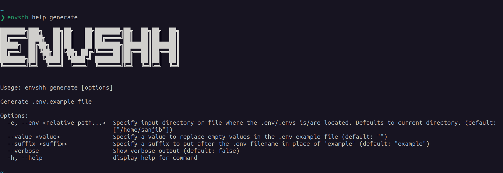

import generateTutorial from '../../../assets/recordings/generate.webm';

> Check `envshh help generate` for more details from the command line

Generate .env.example file

## Demo

<video width="1478" height="772" controls>
  <source src={generateTutorial} type="video/webm" />
</video>

## Screenshot



## Usage

```sh
envshh generate <options>
```

## Options

- [env-path](/core-concepts/env-path)
- value `--value <value>` (Optional):
  Specify a value to replace empty values in the .env example file. For example, if you specify `--value "<insert-text>"`, the generated file will have `EXAMPLE=<insert-text>` instead of `EXAMPLE=`
- suffix `--suffix <suffix>` (Optional):
  Specify a suffix to put after the .env filename in place of 'example'. For example, if you specify `--suffix dev`, the generated file will be named `.env.dev`

## Examples

```sh
envshh generate
```

```sh
envshh generate --value "<insert-text>" # EXAMPLE=<insert-text>
```

```sh
envshh generate --suffix dev # Filename will be [.env filename].dev
```
