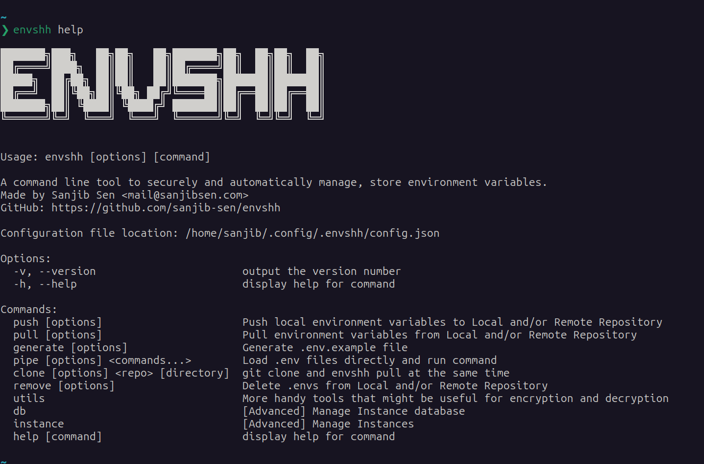

Usage of the commands in envshh

## Screenshot

## Table of Contents

- [push](/commands/push)
- [pull](/commands/pull)
- [generate](/commands/generate)
- [pipe](/commands/pipe)
- [clone](/commands/clone)
- [remove](/commands/remove)
- [instance](/commands/instance)
- [db](/commands/db)
- [utils](/commands/utils)
