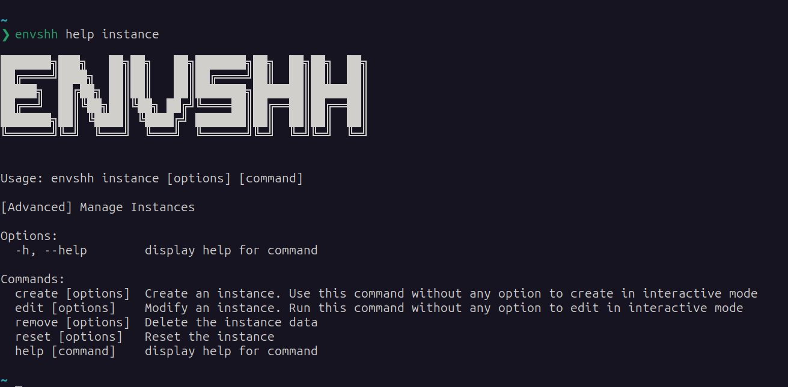

> Check `envshh help instance` for more details from the command line

Learn everything about [Instance](/core-concepts/instance)

## Screenshot



## create

Create a new instance

### Usage

```sh
envshh instance create <options>
```

:::tip[Interactive Mode]
Providing no option will prompt for the values (Interactive Mode)
:::

### Options

- [instanceName](/core-concepts/instance/#1-name-of-the-instance)
  `i, --instance <instanceName>` (Required. But if you don't provide it, it will prompt for the value in interactive mode)
- [remoteRepoUrl](/core-concepts/instance/#2-remote-repository-url)
  `-r, --remote <remote-url>` (Optional)
- [localDirectory](/core-concepts/instance/#3-local-directory-path)
  `-d, --directory <directory>` (Optional)

### Example

```sh
envshh instance create # Create instance in interactive mode
```

```sh
envshh instance create -i work -r https://github.com/acme-corp/work-envs.git -d /home/codes/work-envs # create a new instance named work with remote repository url and local directory path in non-interactive mode
```

## edit

Modify an existing instance

### Usage

Provide the old instance name and the options you want to change
e.g. If you want to change the remote repository url of an instance named `work`, run the following command
`envshh instance edit -i work -r https://github.com/acme-corp/new-work-envs`

```sh
envshh instance edit <options>
```

:::tip[Interactive Mode]
Only providing the old instance name option (Required) will prompt for other values (Interactive Mode)
:::

### Options

- [oldInstanceName](/core-concepts/instance/#1-name-of-the-instance)
  `i, --instance <instanceName>` (Required. But if you don't provide it, it will prompt for the value in interactive mode)
  Previous Instance Name
- [newInstanceName](/core-concepts/instance/#1-name-of-the-instance)
  `--new-name <new-name>` (Optional)
  Change the name of the instance with --new-name option
- [remoteRepoUrl](/core-concepts/instance/#2-remote-repository-url)
  `-r, --remote <remote-url>` (Optional)
  Change the remote repository url with -r or --remote option.
  - If you want to remove the remote repository url in interactive mode, just enter "none" as the value of the option.
  - Removing the remote repository url will make the instance work in [offline](/core-concepts/offline) mode all the time.
  - Changing the remote repository url with a new url will make the instance work in online mode. However, all of the previous commits will be sqaushed to a new commit and set the origin the new repo url.
- [localDirectory](/core-concepts/instance/#3-local-directory-path)
  `-d, --directory <directory>` (Optional)
  Change the local directory path with -d or --directory option
  - Changing the localDirectory will move all previous .envs as well as git commits to the new directory.

### Example

```sh
envshh instance edit -i work # Modify the work instance in interactive mode
```

```sh
envshh instance edit -i work -r https://github.com/acme-corp/work-envs.git -d /home/codes/work-envs # Modify the work instance in non-interactive mode
```

## remove

Remove the local directory (including all the .envs) of an instance. It will also delete the instance from [database](/commands/db). But the remote repository will not be deleted from the hosted git server. So you cannot do `push -i <instance-name>` or `pull -i <instance-name>` anymore. But as it will not be deleted from the hosted git server, you can create a new instance with remote repository url and get those .envs back.

### Usage

```sh
envshh instance remove -i <instance-name>
```

### Other Options

- **yes** `-y, --yes` (Optional):
  Skip confirmation prompt

### Example

```sh
envshh instance remove -i work -y # Remove the work instance without confirmation prompt
```

## reset

Remove all the .envs from the local directory and remote repository and re-git-initialize the local directory and remote repository.
Basically it will reset the instance to the initial state keeping the instance name, reomte repository url, and local directory path same and deleting all the .envs.

### Usage

```sh
envshh instance reset -i <instance-name>
```

### Other Options

- **yes** `-y, --yes` (Optional):
  Skip confirmation prompt

### Example

```sh
envshh instance reset -i work -y
```
