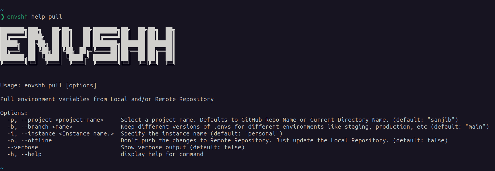

import pullTutorial from '../../../assets/recordings/pull.webm';

> Check `envshh help pull` for more details from the command line

Pull environment variables from Local and/or Remote Repository

## Demo

<video width="1478" height="772" controls>
  <source src={pullTutorial} type="video/webm" />
</video>

## Screenshot



## Usage

```sh
envshh pull <options>
```

## Options

- [project](/core-concepts/project)
- [branch](/core-concepts/branch)
- [offline](/core-concepts/offline)
- [instance](/core-concepts/instance)

## Example

```sh
npx envshh pull
```

```sh
npx envshh pull -b "staging" # staging / production / development / dev / prod anything you like
```

```sh
npx envshh push -p "my-project" # Custom project name if your project name is different from your git repository / directory name
```

```sh
npx envshh pull -o # Just pull form local directory. No remote repository will be pulled
```
