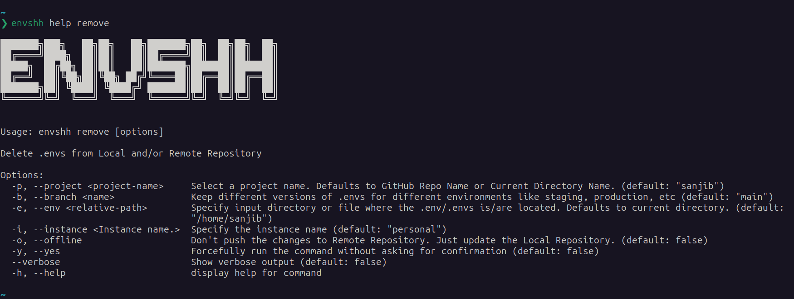

> Check `envshh help remove` for more details

Delete .envs from local and Remote Repository

## Screenshot



## Usage

```sh
envshh remove <options>
```

### Options

- [project](/core-concepts/project)
- [branch](/core-concepts/branch)
- [env-path](/core-concepts/env-path)
- [offline](/core-concepts/offline)
- [instance](/core-concepts/instance)
- **yes** `-y, --yes` (Optional):
  Skip confirmation prompt
