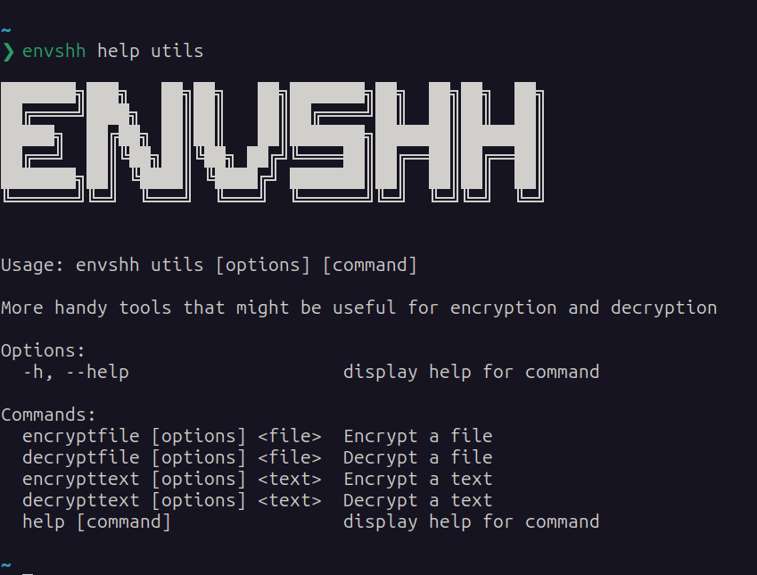

> Check `envshh help utils` for more details

There are some extra commands in envshh which are not directly related to the core functionality of envshh but may come in handy in related works. These commands are:

## Screenshot



## encryptFile

Encrypt a single file using a password (Will be prompted). The encrypted file will be saved in the same directory with the same name with `output.env` extension unless specified via the `-o, --output` option.

### Arguments

- **input** `<inputFilePath>` (Required):
  Path of the file to encrypt

### Options

- **output** `-o, --output <outputFilePath>` (Optional):
  Path of the output file. Default: `output.env`
- **isenv** `-isenv, --isenv` (Optional):
  If the input file is a .env file. Default: `false`
- **replace** `-r, --replace` (Optional):
  Replace the input file with the encrypted file. Default: `false`
  > This will not create any output file. The input file will be replaced with the encrypted file.

### Example Usage

```sh
envshh utils encryptFile ./my-file.txt
```

```sh
envshh utils encryptFile ./my-file.txt -o ./my-encrypted-file.txt
```

```sh
envshh utils encryptFile ./my-file.txt -isenv
```

```sh
envshh utils encryptFile ./my-file.txt -r
```

## decryptFile

Decrypt a single file using a password (Will be prompted). The decrypted file will be saved in the same directory with the same name with `output.env` extension unless specified via the `-o, --output` option.

### Arguments

- **input** `<inputFilePath>` (Required):
  Path of the file to decrypt

### Options

- **output** `-o, --output <outputFilePath>` (Optional):
  Path of the output file. Default: `output.env`
- **isenv** `-isenv, --isenv` (Optional):
- **replace** `-r, --replace` (Optional):
  Replace the input file with the decrypted file. Default: `false`
  > This will not create any output file. The input file will be replaced with the decrypted file.

### Example Usage

```sh
envshh utils decryptFile ./my-file.env
```

```sh
envshh utils decryptFile ./my-file.env -o ./my-decrypted-file.txt
```

```sh
envshh utils decryptFile ./my-file.env -isenv
```

```sh
envshh utils decryptFile ./my-file.env -r
```

## encryptString

Encrypt a string using a password (Will be prompted). The encrypted string will be printed in the console unless specified via the `-o, --output` option.

### Arguments

- **text** `<inputString>` (Required):
  String to encrypt

### Options

- **output** `-o, --output <outputFilePath>` (Optional):
  Path of the output file. Default: Will print in the console

### Example Usage

```sh
envshh utils encryptString
```

```sh
envshh utils encryptString -o ./my-encrypted-string.txt
```

## decryptString

Decrypt a string using a password (Will be prompted). The decrypted string will be printed in the console unless specified via the `-o, --output` option.

### Arguments

- **text** `<inputString>` (Required):
  String to decrypt

### Options

- **output** `-o, --output <outputFilePath>` (Optional):
  Path of the output file. Default: Will print in the console

### Example Usage

```sh
envshh utils decryptString
```

```sh
envshh utils decryptString -o ./my-decrypted-string.txt
```
