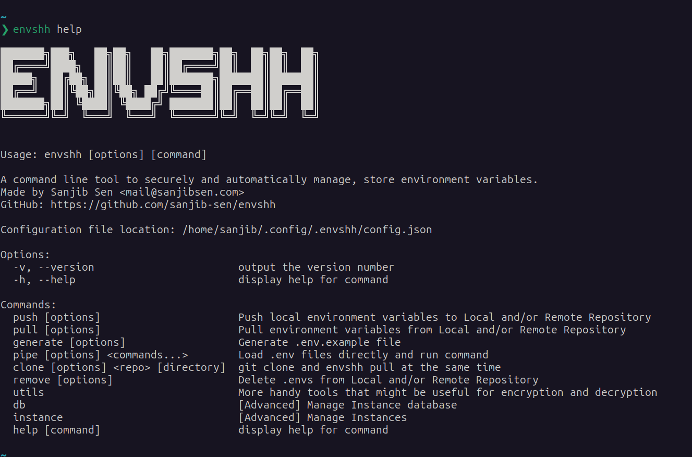

Trust me when I say this, you are not the only one who faced riddiculus amount of issues and inconveniences with managing .envs.

If you are using multiple devices or working with a team, you know how hard it is to keep track of all the .envs and their changes. You might have faced issues like:

- **Asking your team members** to send you the latest .env files everytime they make a change.
- **Corrupting the .env files** because you forgot what temporary changes you did for using a different API_KEY.
- **Accidentally pushing .env files** with sensitive information to the git repository.
- **Need to manually create and copy .env files** from one project to another, or worse, one device to another.
- **Need to manually create .env.example** files for your team members to know what .env variables are required.
- **rm -rf project && git clone project** "Oh no! I have to ask my CTO for the .env again".
- **Forgot to add dotenv.config()** "proces.env.KEY=undefined!".
- **Losing track of .env changes** because you can't keep track of them (until now!).

Not to mention how unsafe and dangerous it is to share your .env with your colleagues via slack / discord / teams / email / etc.

Well, you are not alone. We have all been there. And that's why we created Envshh.

## What is Envshh?

Envshh is a CLI tool that helps you to manage your .env files. It is very simple and most importantly, **IT DOES NOT EVEN TAKE A MINUTE to install, learn, use!**

## How does it work?

Envshh uses a simple concept of **Encrypted .envs in git**. You can use any git repository like GitHub, GitLab, or even your own self-hosted git server. Envshh will encrypt your .env files with your own password and store them in your own git repository. You can then pull the .env files from any device you want.

## Features

- **Encrypted .envs in git** - Your .envs are encrypted and stored in your own git repository. You can use any git repository like GitHub, GitLab, or even your own self-hosted git server.
- **Multiple Branches** - You can use multiple [branches](/core-concepts/branch) to store different .envs. For example, you can use `dev` branch for development .envs, `prod` branch for production .envs, and `test` branch for testing .envs.
- **Multiple Instances** - You can create unlimited [instances](/core-concepts/instance) and save the .envs to different git repositories.
- **Super Easy and Convenient** - `envshh pull`, `envshh push`, `envshh push -b staging`, `envshh pull -b staging` , `envshh push -i work-envs`, `envshh pipe`, `envshh generate` - That's all you need to know to use Envshh. How easier can it be?
- **Offline Mode** - You can use the `offline` option to temporarily disable the remote repository and use only the local directory to store the .envs. Git features will still work.
- **Generate .env.example** - You can generate a `.env.example` file from your .env files.
- **Pipe .env to stdin** - You can [pipe](/commands/pipe) a .env file to stdin. Then run your command. The .env variables will be available in the process.env without importing dotenv and using dotenv.config(), dotenv.load() or any other library in your codebase.
- **git clone and get .envs** - You can [clone](/commands/clone) your project just like `git clone` but get .envs for the project automatically without any extra steps, even they are in ``.gitignore`.
- **Super Secure** - Your .envs are [encrypted](/start-here/security) with a highly secure and encrypted algorithm with your own password. So even if someone gets access to your git repository (Even Microsoft), they won't be able to decrypt the .envs without your password.
- **Easy to use** - Envshh is very easy to use. You can get started in less than a minute. See [Quick Usage](/start-here/quick-usage) to get started.
- **Cross Platform** - Envshh is cross platform. It works on Windows, Linux, and Mac.
- **Customizable** - From default branch to default instance, from directory to .env filename
  patterns, you can customize everything. To learn more about this, check out
  the [Configuration](/configuration) page.
- **Open Source** - Envshh is completely open source. You can contribute to the project on [GitHub](https://github.com/sanjib-sen/envshh)
- **Free** - Envshh is free to use and always will be. You can use it for personal or commercial use.
- **No Registration** - You don't need to register to use Envshh. Just install and use it.
- **No Internet Required** - You don't need internet to use Envshh. You can use it offline. See [Offline](/core-concepts/offline) for more details.
- **No Dependencies** - Envshh does not have any dependencies. It is built with pure Node.js. So you don't need to install any other dependencies to use Envshh.
- **No Installation Required** - You don't need to install Envshh. You can use it with npx or pnpx or yarn dlx. See [Quick Usage](/start-here/quick-usage) for more details.
- **No Configuration Required** - You don't need to configure Envshh. It works out of the box. But you can customize it to your needs. See [Configuration](/configuration) for more details.

## How to get started?

See [Quick Usage](/start-here/quick-usage) to get started.

## Installation

Fun fact, you don't need to install Envshh. You can use it with npx or pnpx or yarn dlx. See [Quick Usage](/start-here/quick-usage) for more details.
But if you can [install](/start-here/installation) it globally if you want. It is recommended though.

## Screenshot

## Commands

See [Commands](/commands).

## Core Concepts / Common Command Options

See [core-concepts](/core-concepts).

## License

MIT © [Sanjib Sen](2023)

## Built Using

- [NodeJs](https://nodejs.org/en/)
- [TypeScript](https://www.typescriptlang.org/)

## Authors

- [@sanjib-sen](https://github.com/sanjib-sen)

---
